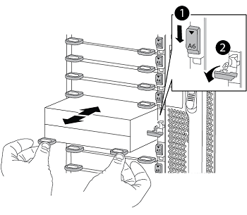

= Ersetzen Sie die node1-Systemmodule
:hardbreaks:
:allow-uri-read: 
:nofooter: 
:icons: font
:linkattrs: 
:imagesdir: ./media/

[role="lead"]
Ersetzen Sie die node1-Systemmodule für Ihre Upgrade-Konfiguration:

* <<replace_modules,Austausch des Controller-Moduls AFF A220, AFF A200, AFF C190, FAS2720 oder FAS2720>>
+

NOTE: Mit diesem Verfahren können Sie auch einen AFF A220 ersetzen, der als ASA konfiguriert ist.

* <<Ersetzen Sie den AFF A700- oder FAS9000-Controller und die NVRAM-Module>>
+

NOTE: Mit diesem Verfahren können Sie auch eine als ASA konfigurierte AFF A700 ersetzen.

== Austausch des Controller-Moduls AFF A220, AFF A200, AFF C190, FAS2720 oder FAS2720

An dieser Stelle ist node1 ausgefallen und alle Daten werden von node2 bereitgestellt. Da sich Node1 und Node2 im gleichen Chassis befinden und durch denselben Satz an Netzteilen mit Strom versorgt werden, schalten Sie das Chassis NICHT aus. Sie müssen darauf achten, nur das Knoten 1-Controller-Modul zu entfernen. Normalerweise ist node1 Controller A, der sich auf der linken Seite des Chassis befindet, wenn man sich die Controller von der Rückseite des Systems ansieht. Das Controller-Etikett befindet sich direkt über dem Controller-Modul auf dem Chassis.

.Bevor Sie beginnen
Wenn du nicht bereits geerdet bist, beground dich richtig.

=== Entfernen Sie das Controller-Modul AFF A220, AFF A200, AFF C190, FAS2720 oder FAS2720

Um auf Komponenten innerhalb des Controllers zuzugreifen, müssen Sie zuerst das Controller-Modul aus dem System entfernen und dann die Abdeckung am Controller-Modul entfernen.

.Schritte
. Lösen Sie den Haken- und Schlaufenriemen, mit dem die Kabel am Kabelführungsgerät befestigt sind, und ziehen Sie dann die Systemkabel und SFPs (falls erforderlich) vom Controller-Modul ab, um zu verfolgen, wo die Kabel angeschlossen waren.
+
Lassen Sie die Kabel im Kabelverwaltungs-Gerät so, dass bei der Neuinstallation des Kabelverwaltungsgeräts die Kabel organisiert sind.

. Entfernen Sie die Kabelführungsgeräte von der linken und rechten Seite des Controller-Moduls und stellen Sie sie zur Seite.
+
image::../media/drw_25xx_cable_management_arm.png[Entfernen der Kabelverwaltungs-ARM]

. Drücken Sie die Verriegelung am Nockengriff, bis sie loslässt, öffnen Sie den Nockengriff vollständig, um das Controller-Modul aus der Mittelplatine zu lösen, und ziehen Sie das Controller-Modul anschließend mit zwei Händen aus dem Gehäuse heraus.
+
image::../media/drw_2240_x_opening_cam_latch.png[Öffnen des Nockengriffs]

. Drehen Sie das Controller-Modul um und legen Sie es auf eine flache, stabile Oberfläche.

=== Installieren Sie das Controller-Modul ASA A150, AFF A150 oder FAS2820

Gehen Sie wie folgt vor, um das Controller-Modul ASA A150, AFF A150 oder FAS2820 in Knoten1 zu installieren.

.Schritte
. Richten Sie das Ende des Controller-Moduls an der Öffnung im Gehäuse aus, und drücken Sie dann vorsichtig das Controller-Modul zur Hälfte in das System.
+

NOTE: Setzen Sie das Controller-Modul erst dann vollständig in das Chassis ein, wenn Sie dazu aufgefordert werden.

. Verkabeln Sie die Management- und Konsolen-Ports mit dem Node1-Controller-Modul.
+

NOTE: Da das Gehäuse bereits eingeschaltet ist, startet node1 die BIOS-Initialisierung und dann Autoboot, sobald es vollständig eingesetzt ist. Um den node1-Boot zu unterbrechen, bevor das Controller-Modul vollständig in den Steckplatz eingesetzt wird, wird empfohlen, die serielle Konsole und die Verwaltungskabel mit dem node1-Controller-Modul zu verbinden.

. Schieben Sie das Steuermodul bei geöffnetem Nockengriff fest hinein, bis es auf die Mittelplatine trifft und vollständig eingesetzt ist. Die Verriegelung steigt, wenn das Controller-Modul voll eingesetzt ist. Schließen Sie den Nockengriff in die verriegelte Position.
+

NOTE: Um Schäden an den Anschlüssen zu vermeiden, sollten Sie beim Einschieben des Controller-Moduls in das Gehäuse keine übermäßige Kraft verwenden.

. Schließen Sie die serielle Konsole an, sobald das Modul eingesetzt ist und bereit ist, DEN AUTOSTART von node1 zu unterbrechen.
. Nachdem Sie DIE AUTOBOOT-Funktion unterbrochen haben, wird node1 an der LOADER-Eingabeaufforderung angehalten. Wenn Sie DAS AUTOBOOT nicht rechtzeitig unterbrechen und node1 startet, warten Sie auf die Eingabeaufforderung und drücken Sie *Strg-C*, um in das Boot-Menü zu gelangen. Nachdem der Node im Boot-Menü angehalten wurde, können Sie den Node mit Option 8 neu booten und DEN AUTOBOOT während des Neubootens unterbrechen.
. Legen Sie an der Eingabeaufforderung „LOADER> von node1“ die Standardvariablen für die Umgebung fest:
+
`set-defaults`

. Speichern Sie die Standardeinstellungen für Umgebungsvariablen:
+
`saveenv`

== Ersetzen Sie den AFF A700- oder FAS9000-Controller und die NVRAM-Module

An dieser Stelle ist node1 ausgefallen und alle Daten werden von node2 bereitgestellt. Da sich Node1 und Node2 im gleichen Chassis befinden und durch denselben Satz an Netzteilen mit Strom versorgt werden, schalten Sie das Chassis NICHT aus. Achten Sie darauf, nur das Node1-Controller-Modul und das node1-NVRAM-Modul zu entfernen. Normalerweise ist node1 Controller A, der sich auf der linken Seite des Chassis befindet, wenn man sich die Controller von der Rückseite des Systems ansieht. Das Controller-Etikett befindet sich direkt über dem Controller-Modul auf dem Chassis.

.Bevor Sie beginnen
Wenn du nicht bereits geerdet bist, beground dich richtig.

=== Entfernen Sie das AFF A700 oder das FAS9000 Controller-Modul

Gehen Sie wie folgt vor, um das AFF A700 oder das FAS9000 Controller-Modul zu entfernen.

.Schritte
. Trennen Sie ggf. das Konsolenkabel und das Managementkabel aus dem node1-Controller-Modul, bevor Sie das Controller-Modul aus node1 entfernen.
+

WARNING: Wenn Sie an node1 arbeiten, entfernen Sie nur die Konsole und E0M-Kabel von node1. Sie dürfen während dieses Vorgangs keine anderen Kabel oder Anschlüsse an node1 oder node2 entfernen oder austauschen.

. Entriegeln und entfernen Sie das Controller-Modul A aus dem Gehäuse.
+
.. Schieben Sie die orangefarbene Taste am Nockengriff nach unten, bis sie entsperrt ist.
+
image::../media/drw_9500_remove_PCM.png[Entfernen Sie das Controller-Modul]

+
[cols="20,80"]
|===

 a| 
image::../media/black_circle_one.png[Nummer eins]
| Freigabetaste für den CAM-Griff 

 a| 
image::../media/black_circle_two.png[Nummer zwei]
| CAM-Griff 
|===
.. Drehen Sie den Nockengriff so, dass er das Controller-Modul vollständig aus dem Gehäuse herausrückt, und schieben Sie dann das Controller-Modul aus dem Gehäuse.
+
Stellen Sie sicher, dass Sie die Unterseite des Controller-Moduls unterstützen, während Sie es aus dem Gehäuse schieben.

=== Entfernen Sie das AFF A700 oder FAS9000 NVRAM-Modul

Gehen Sie wie folgt vor, um das AFF A700 oder das FAS9000 NVRAM-Modul zu entfernen.

NOTE: Das AFF A700 oder FAS9000 NVRAM-Modul befindet sich in Steckplatz 6 und hat die doppelte Höhe der anderen Module im System.

.Schritte
. Entriegeln und entfernen Sie das NVRAM-Modul aus Steckplatz 6 der Node1.
+
.. Drücken Sie die Taste mit der Nummerierung und dem Buchstaben.
+
Die Nockentaste bewegt sich vom Gehäuse weg.

.. Drehen Sie die Nockenverriegelung nach unten, bis sie sich in horizontaler Position befindet.
+
Das NVRAM-Modul geht aus dem Chassis aus und verschiebt ein paar Zentimeter.

.. Entfernen Sie das NVRAM-Modul aus dem Gehäuse, indem Sie an den Zuglaschen an den Seiten der Modulfläche ziehen.
+

+
[cols="20,80"]
|===

 a| 
image::../media/black_circle_one.png[Nummer eins]
| Gerettete und nummerierte E/A-Nockenverriegelung 

 a| 
image::../media/black_circle_two.png[Nummer zwei]
| E/A-Riegel vollständig entriegelt 
|===

=== Installieren Sie die NVRAM- und Controller-Module ASA A900, AFF A900 oder FAS9500

Installieren Sie die ASA A900, AFF A900 oder FAS9500 NVRAM- und Controller-Module, die Sie für das Upgrade auf Knoten1 erhalten haben.

Bei der Installation müssen Sie Folgendes beachten:

* Verschieben Sie alle Leereinfüllmodule in den Steckplätzen 6-1 und 6-2 vom alten NVRAM-Modul in das neue NVRAM-Modul.
* Verschieben Sie das coredump-Gerät NICHT aus dem AFF A700 NVRAM-Modul in das ASA A900- oder AFF A900 NVRAM-Modul.
* Verschieben Sie alle Flash Cache Module, die im FAS9000 NVRAM-Modul installiert sind, auf das FAS9500 NVRAM-Modul.

.Bevor Sie beginnen
Wenn du nicht bereits geerdet bist, beground dich richtig.

==== Installieren Sie das NVRAM-Modul ASA A900, AFF A900 oder FAS9500

Gehen Sie wie folgt vor, um das NVRAM-Modul ASA A900, AFF A900 oder FAS9500 in Steckplatz 6 von Knoten1 zu installieren.

.Schritte
. Richten Sie das NVRAM-Modul an den Kanten der Gehäuseöffnung in Steckplatz 6 aus.
. Schieben Sie das NVRAM-Modul vorsichtig in den Steckplatz, bis der vorletzte und nummerierte E/A-Nockenriegel mit dem E/A-Nockenstift einrastet. Drücken Sie dann den E/A-Nockenverschluss bis zum Verriegeln des NVRAM-Moduls.
+

+
[cols="20,80"]
|===

 a| 
image::../media/black_circle_one.png[Nummer eins]
| Gerettete und nummerierte E/A-Nockenverriegelung 

 a| 
image::../media/black_circle_two.png[Nummer zwei]
| E/A-Riegel vollständig entriegelt 
|===

==== Installieren Sie das Controller-Modul ASA A900, AFF A900 oder FAS9500 auf Knoten1.

Gehen Sie wie folgt vor, um das Controller-Modul ASA A900, AFA A900 oder FAS9500 in Knoten1 zu installieren.

.Schritte
. Richten Sie das Ende des Controller-Moduls an der Öffnung A im Gehäuse aus, und drücken Sie dann vorsichtig das Controller-Modul zur Hälfte in das System.
+

NOTE: Setzen Sie das Controller-Modul erst dann vollständig in das Chassis ein, wenn Sie dazu aufgefordert werden.

. Verkabeln Sie die Management- und Konsolen-Ports mit dem Node1-Controller-Modul.
+

NOTE: Da das Gehäuse bereits eingeschaltet ist, startet node1 die BIOS-Initialisierung und dann Autoboot, sobald es vollständig eingesetzt ist. Um den node1-Boot zu unterbrechen, bevor das Controller-Modul vollständig in den Steckplatz eingesetzt wird, wird empfohlen, die serielle Konsole und die Verwaltungskabel mit dem node1-Controller-Modul zu verbinden.

. Drücken Sie das Controller-Modul fest in das Gehäuse, bis es auf die Mittelebene trifft und vollständig sitzt.
+
Die Verriegelung steigt, wenn das Controller-Modul voll eingesetzt ist.

+

WARNING: Um Schäden an den Anschlüssen zu vermeiden, sollten Sie beim Einschieben des Controller-Moduls in das Gehäuse keine übermäßige Kraft verwenden.

+
image::../media/drw_9500_remove_PCM.png[Installieren Sie das Controller-Modul]

+
[cols="20,80"]
|===

 a| 
image::../media/black_circle_one.png[Nummer eins]
| Verriegelungsverschluss am CAM-Griff 

 a| 
image::../media/black_circle_two.png[Nummer zwei]
| Nockengriff in der nicht entriegeln Position 
|===
. Schließen Sie die serielle Konsole an, sobald das Modul eingesetzt ist und bereit ist, DEN AUTOSTART von node1 zu unterbrechen.
. Nachdem Sie DIE AUTOBOOT-Funktion unterbrochen haben, wird node1 an der LOADER-Eingabeaufforderung angehalten. Wenn SIE DIE AUTOBOOT-Zeit nicht unterbrechen und node1 den Startvorgang startet, warten Sie auf die Eingabeaufforderung und drücken Sie *Strg-C*, um in das Startmenü zu gelangen. Nachdem der Knoten im Startmenü angehalten wurde, verwenden Sie die Option `8` Um den Node neu zu booten und den AUTOBOOT während des Neubootens zu unterbrechen.
. Legen Sie an der Eingabeaufforderung „LOADER> von node1“ die Standardvariablen für die Umgebung fest:
+
`set-defaults`

. Speichern Sie die Standardeinstellungen für Umgebungsvariablen:
+
`saveenv`

