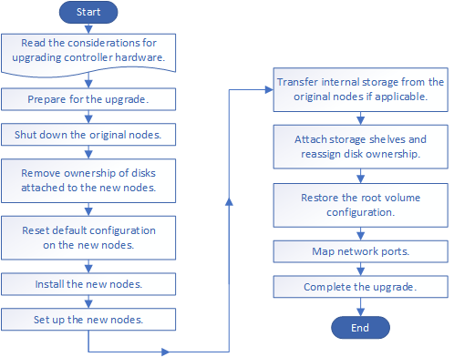

= Workflow
:allow-uri-read: 
:icons: font
:imagesdir: ../media/

[role="lead"]
Bei einem Upgrade der Controller Hardware durch Verschiebung des Storage bereiten Sie die Original-Nodes vor und richten die neuen Nodes ein. Einige Plattformmodelle unterstützen den Transfer von internem Storage zu den neuen Nodes. Sie weisen Festplatten neu zu und stellen die Root-Volume-Konfiguration den neuen Nodes wieder her und konfigurieren Netzwerkports. Das Upgrade durch Verschiebung von Storage führt zu Unterbrechungen.

[NOTE]
====
In den Schritten zum Upgrade der Controller-Hardware durch Verschiebung von Storage werden die ursprünglichen Nodes node1 und node2 genannt und die neuen Nodes werden node3 und node4 genannt. Während des beschriebenen Verfahrens wird node1 durch node3 ersetzt und node2 durch node4 ersetzt.

image::../upgrade/media/original_to_new_nodes.png[Original zu neuen Knoten]

Die Begriffe node1, node2, node3 und node4 werden nur verwendet, um zwischen den ursprünglichen und den neuen Knoten zu unterscheiden. Wenn Sie das Verfahren befolgen, müssen Sie diese durch die echten Namen Ihrer ursprünglichen und neuen Knoten ersetzen. In der Realität ändern sich jedoch die Namen der Nodes nicht: node3 hat den Namen node1 und node4 hat nach dem Upgrade der Controller-Hardware den Namen node2.

====
.Schritte
. xref:upgrade-prepare-when-moving-storage.adoc[Bereiten Sie sich bei der Verschiebung des Storage auf das Upgrade vor]
. xref:upgrade-shutdown-remove-original-nodes.adoc[Fahren Sie die ursprünglichen Nodes herunter]
. xref:upgrade-remove-disk-ownership-new-nodes.adoc[Entfernen Sie die Eigentumsrechte an den Festplatten, die mit den neuen Nodes verbunden sind]
. xref:upgrade-reset-default-configuration-node3-and-node4.adoc[Setzen Sie die Standardkonfiguration auf den neuen Nodes zurück]
. xref:upgrade-install-new-nodes.adoc[Die neuen Nodes installieren]
. xref:upgrade-set-up-new-nodes.adoc[Richten Sie die neuen Nodes ein]
. xref:upgrade-optional-move-internal-storage.adoc[Optional: Verschieben Sie internen Storage oder konvertieren Sie das System in ein Festplatten-Shelf]
. xref:upgrade-attach-shelves-reassign-disks.adoc[Verbinden Sie Storage Shelfs und weisen Sie Festplatten neu zu]
. xref:upgrade-restore-root-volume-config.adoc[Wiederherstellung der Konfiguration des Root-Volumes]
. xref:upgrade-complete.adoc[Schließen Sie das Upgrade ab]

.Verwandte Informationen
* xref:upgrade_aff_a250_to_aff_a400_ndu_upgrade_workflow.adoc[Upgrade von AFF A250 auf AFF A400 durch Konvertierung in ein Festplatten-Shelf] (Ein unterbrechungsfreies Verfahren).

