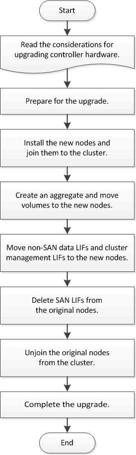

= Workflow
:allow-uri-read: 
:icons: font
:imagesdir: ../media/

[role="lead"]
Bei einem Upgrade der Controller Hardware durch Verschieben von Volumes bereiten Sie die ursprünglichen Nodes vor und fügen die neuen Nodes dem Cluster hinzu. Sie verschieben Volumes zu den neuen Nodes, konfigurieren LIFs und heben die Join der Original-Nodes vom Cluster ab. Das Upgrade durch Verschieben von Volumes erfolgt unterbrechungsfrei.

.Schritte
. xref:upgrade-prepare-when-moving-volumes.adoc[Vorbereitung auf das Upgrade beim Verschieben von Volumes]
. xref:upgrade-install-and-join-new-nodes-move-vols.adoc[Installieren Sie die neuen Nodes und fügen Sie sie dem Cluster hinzu]
. xref:upgrade_move_linux_iscsi_hosts_to_new_nodes.html[Verschieben Sie Linux-iSCSI-Hosts auf die neuen Knoten]
. xref:upgrade-create-aggregate-move-volumes.adoc[Erstellung eines Aggregats und Verschiebung von Volumes zu den neuen Nodes]
. xref:upgrade-move-lifs-to-new-nodes.adoc[Verschieben Sie LIFs für nicht-SAN-Daten und Clustermanagement-LIFs auf die neuen Nodes]
. xref:upgrade_move_delete_recreate_san_lifs.adoc[Verschieben, löschen oder erstellen Sie SAN-LIFS]
. xref:upgrade-unjoin-original-nodes-move-volumes.adoc[Heben Sie die Verbindung der ursprünglichen Nodes vom Cluster auf]
. xref:upgrade-complete-move-volumes.adoc[Schließen Sie das Upgrade ab]

